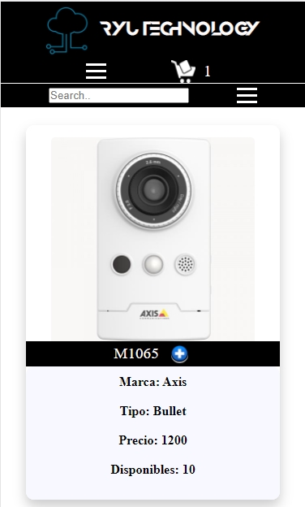

# Ryu Technology

Este site es de una empresa dedicada al rubro tecnológico de la ingeniería de redes y su aplicación en el ámbito de comunicaciones, seguridad, automatización y domótica,
tanto a nivel empresarial como en los hogares. Esta versión está enfocada en productos de networking y cámaras de vigilancia, para un e-commerce.

## Comenzando 🚀

Este es un proyecto público, puedes decargarte una copia desde la pestaña code o haciendo un Clone 😊

Mira [aquí](https://luiggimarquez.github.io/Ryutechnology_V2/) para conocer como luce el proyecto o en **Deployment**

El proyecto está formado por 4 páginas:  index, productos, factura y contacto.

El archivo principal de SASS es estilos.scss, desde éste se llaman mediante partials a las otras
hojas.

El SASS compila del archivos estilos.scss de la carpeta SCSS, en el archivo styles.css en la
carpeta CSS (ver archivo package.json)

Los archivos Javascript están en la carpeta JS, que se encuentra organizada asi:

    > JS folder: contiene los archivos principales:
        - main.js: carga los archivos desde un JSON local
        - app.js: llama a la función encargada de armar los productos en el inicio del DOM
        - cargaProductos.js: escribe en el DOM los productos del e-commerce.
    
    > Components folder: contiene los componentes de los archivos javascript usados para elaborar la lógica del funcionamiento:
        - cart: posee todos los componentes usados para el desarrollo del carrito de compras (su lógica)
        - invoice: tiene la lógica para imprimir en elementos HTML la info de la factura
        - menu: este folder contiene todos los componentes usados para los accesos y menus del sitio, como el modal del carrito,
        los menus burguer del responsive, el menu de busqueda, el menu del filtrado, el slider de imagen y el tab del index.

    > Data folder: contiene el JSON que cumple la función de base datos del sitio.

### Pre-requisitos 📋

Para poder usar los SCSS, es necesario tener instalado node.js y tener instalado nodemon.
Puedes utilizar Visual Studio Code o Sublime Text para revisarlo 🔧

### Instalación 

Estas instrucciones están hechas para **Visual Studio Code**, con el cual lo realicé:

* Instala **node.js** y **npm** desde https://nodejs.org/es/download/

* En el Visual Studio Code úbicate en el directorio del proyecto

* Inicia el `npm`, con `npm init` en TERMINAL (Ctrl + ñ)

* Instala el **nodemon** con: `npm install -D node-sass nodemon`

* Compila con `npm run watch-css`

Si ya tienes instalado el node.js, ya están incluidos los files package.json y los .scss, puedes editar directamente los .scss 😊
y solamente compilar el proyecto para comenzar.

## Construido con 🛠️

* La mayor parte del código está hecho directamente con CSS en Visual Studio Code 1.63.2

* Todo la lógica está escrita en `JavaScript Vanilla` directamente.

* Las imágenes no son de mi autoría, todo es material público en internet.

* Componentes como el Tabs de index, el Slider de imágenes, el modal del carrito, Range Slider son ideas tomadas de https://www.w3schools.com/ y modificadas para el proyecto.

* Para el menú de filtros de cámaras, tomé el código de https://www.npmjs.com/package/@github/check-all para seleccionar los checkbox a la vez

* La fuente del título, fue tomada de https://befonts.com/anurati-font.html

* El layout está desarrollado con Flexbox y una parte de Grid.

* El sitio es responsivo para los breakpoint 1200px, 1024px, 769px, 480px, 319px.

* Se usó para las alertas `SweetAlert2`, https://sweetalert2.github.io/

## Autor✒️

Este proyecto fue realizado para las clases de JavaScript de CoderHouse por:

**Ing. Luiggi Márquez** - [GitHub Profile](https://github.com/luiggimarquez) ✌️

Buenos Aires, Argentina 2022

